# 🔥 API OWASP Top 10 – Enterprise Vulnerable Lab


---

# 📌 Project Overview

This project demonstrates **all OWASP API Security Top 10 vulnerabilities** using a purposely vulnerable Flask-based API.

It is designed for:

- 🛡 API Pentesting Practice
- 🎯 Bug Bounty Training
- 💼 Interview Demonstration
- 📂 Security Portfolio Showcase

---

# 🛠 Technology Stack

- Python 3
- Flask
- SQLite
- PyJWT
- Postman
- Requests Library

---

# 🚀 Installation Guide

## 1️⃣ Install Python

Download: https://python.org  
Ensure "Add Python to PATH" is enabled.

Verify:

```bash
python --version
```

---

## 2️⃣ Clone Repository

```bash
git clone https://github.com/YOUR_USERNAME/API-OWASP-TOP-10-ENTERPRISE-LAB.git
cd API-OWASP-TOP-10-ENTERPRISE-LAB
```

---

## 3️⃣ Install Dependencies

```bash
pip install -r requirements.txt
```

---

## 4️⃣ Reset Database (Important)

Delete:

```
users.db
```

---

## 5️⃣ Run Application

```bash
python app.py
```

Server will run at:

```
http://127.0.0.1:5000
```

---

# 📸 Server Running

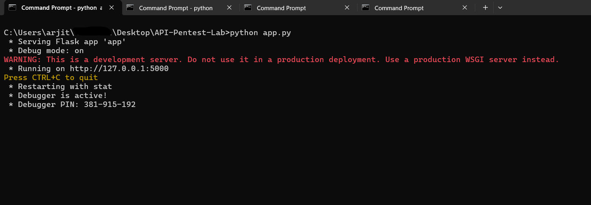

---

# 🔟 OWASP API Top 10 – Practical Demonstration

---

## 🥇 API1 – Broken Object Level Authorization (BOLA / IDOR)

- Endpoint: `GET /user/<id>`
- Change object ID to access other users

📸  
  
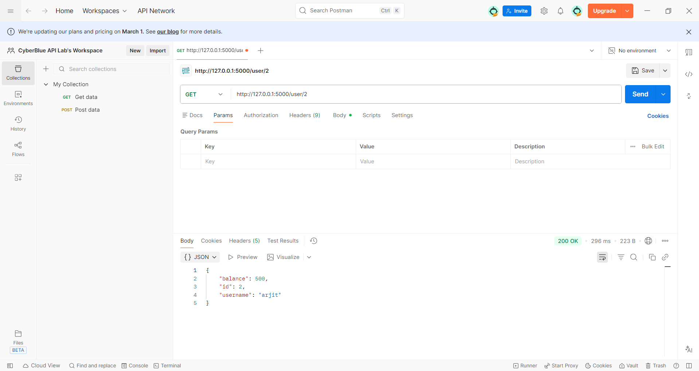

Impact: Unauthorized data exposure

---

## 🥈 API2 – Broken Authentication (SQL Injection)

- Endpoint: `POST /login`
- Payload:

```json
{
  "username": "' OR 1=1 --",
  "password": "anything"
}
```

📸  
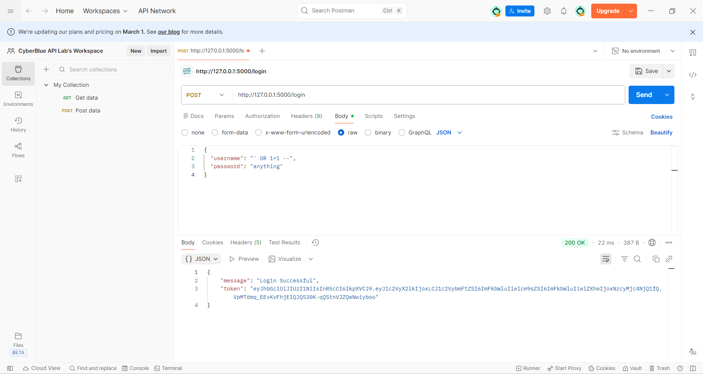

Impact: Authentication bypass

---

## 🥉 API3 – Mass Assignment (Privilege Escalation)

- Endpoint: `PUT /update-profile`
- Payload:

```json
{
  "role": "admin"
}
```

📸  
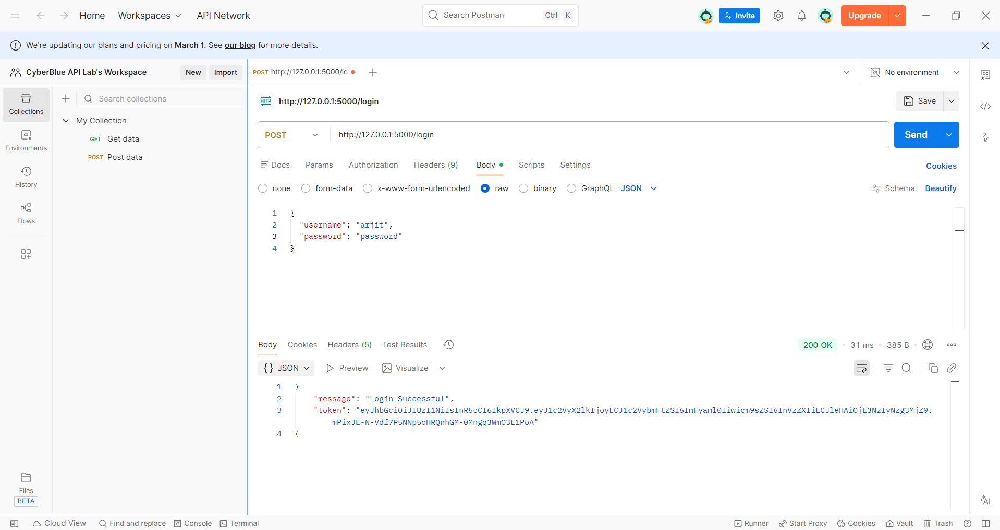  
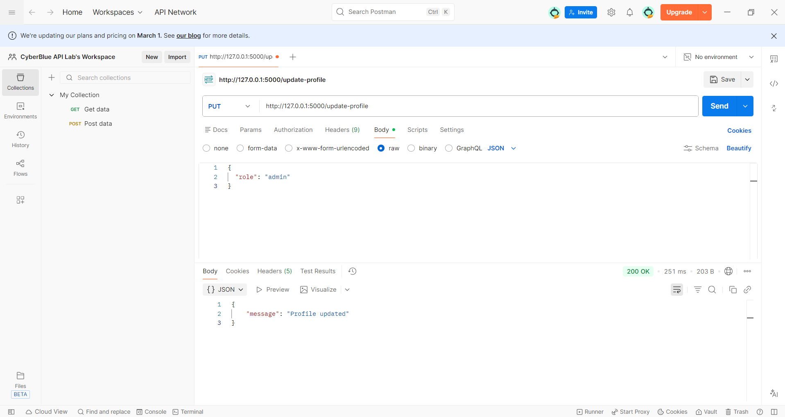  
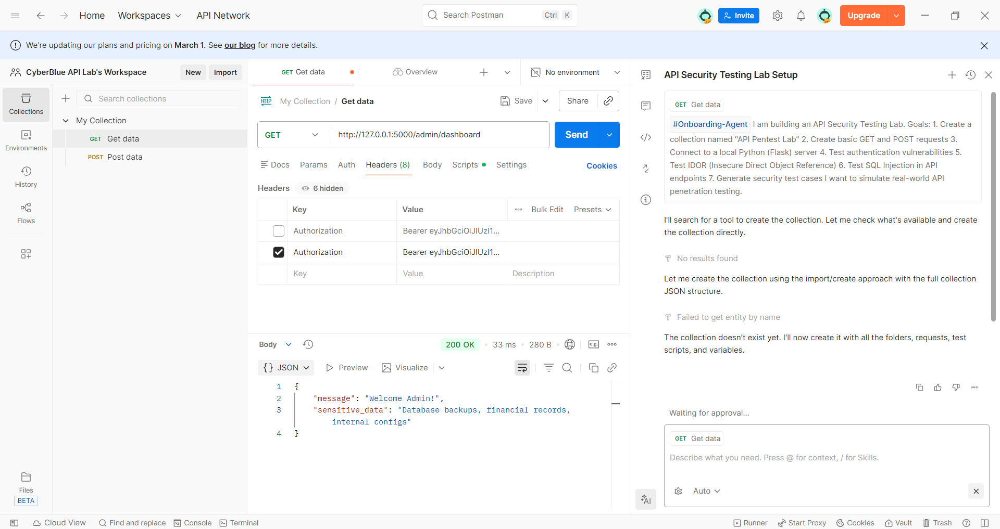

Impact: Admin privilege escalation

---

## 4️⃣ API4 – Unrestricted Resource Consumption

- No rate limiting
- Unlimited login attempts

📸  
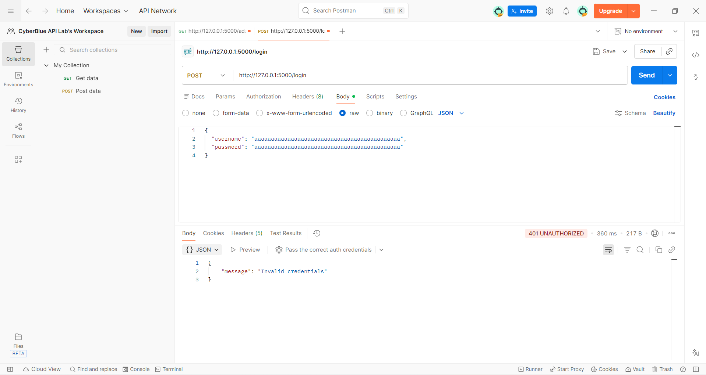

Impact: DoS potential

---

## 5️⃣ API5 – Broken Function Level Authorization

- Endpoint: `GET /admin/dashboard`
- Normal user accessing admin function

📸  
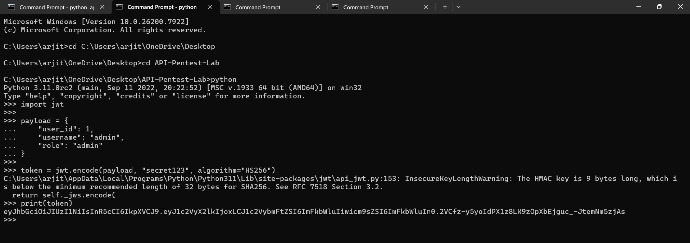  
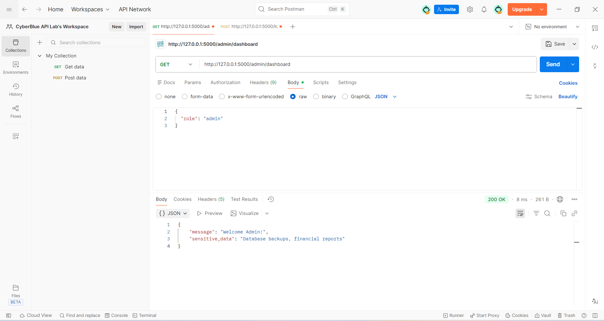

Impact: Admin function exposure

---

## 6️⃣ API6 – Business Logic Flaw

- Endpoint: `POST /transfer`
- Negative amount manipulation

📸  
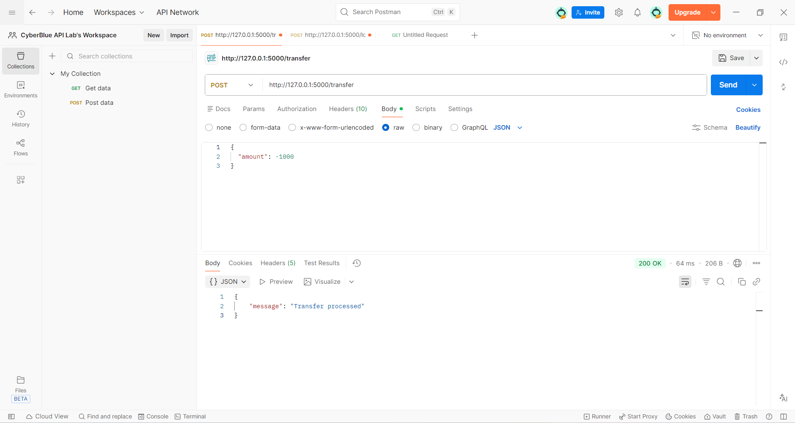

Impact: Financial abuse

---

## 7️⃣ API7 – Server-Side Request Forgery (SSRF)

- Endpoint: `POST /fetch-url`
- Payload:

```json
{
  "url": "http://127.0.0.1:5000/debug-info"
}
```

📸  
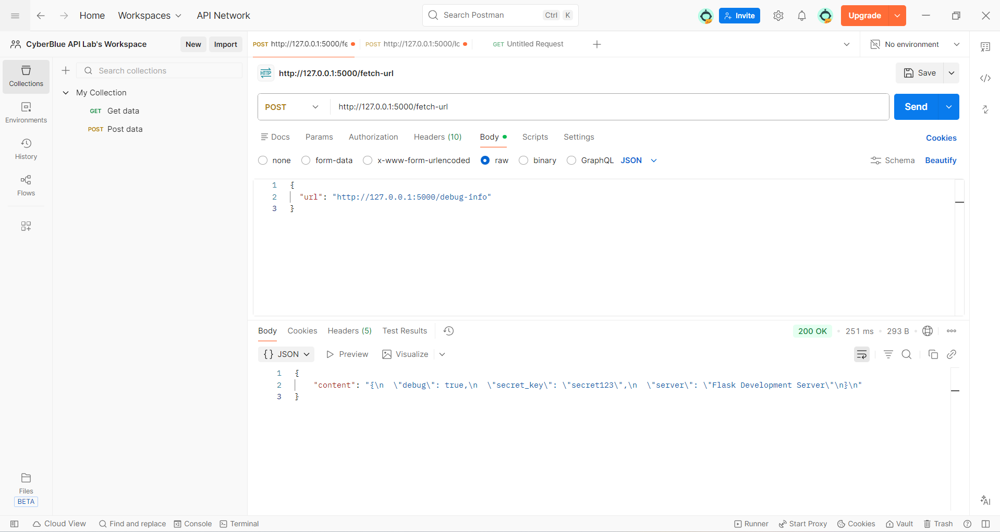

Impact: Internal service exposure

---

## 8️⃣ API8 – Security Misconfiguration

- Endpoint: `GET /debug-info`
- Secret key exposed
- Debug mode enabled

📸  
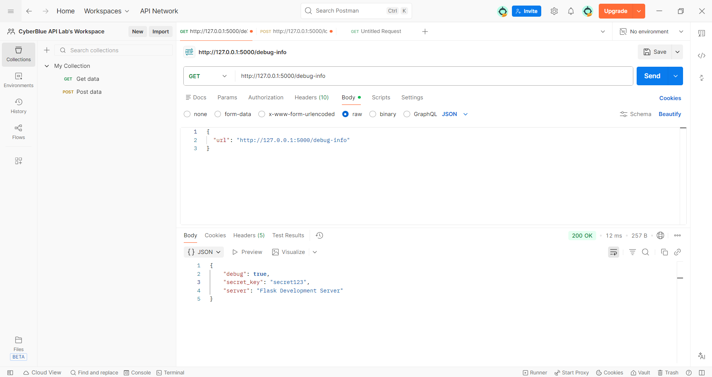

Impact: Sensitive configuration leakage

---

## 9️⃣ API9 – Improper Inventory Management

- Endpoint: `GET /api/v1/users`
- Old API version exposed

📸  
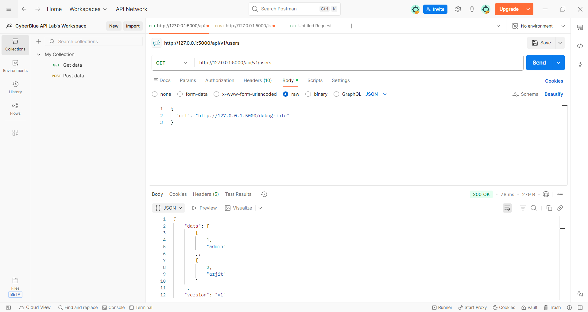

Impact: Legacy endpoint exposure

---

## 🔟 API10 – Unsafe Consumption of APIs

- Endpoint: `POST /external-data`
- Blind trust of external API response

📸  
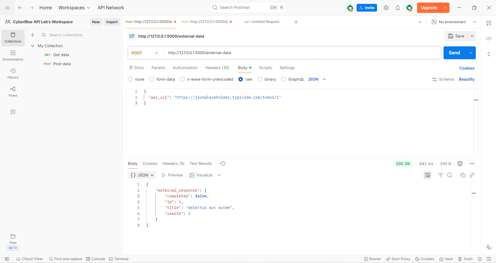

Impact: Data poisoning risk

---

# 🔗 Full Attack Chain Demonstration

1. SQL Injection → Login as admin  
2. IDOR → Enumerate users  
3. Mass Assignment → Change role  
4. Access Admin Dashboard  
5. SSRF → Access internal data  

Full system compromise achieved.

---

# 📁 Project Structure

```
API-OWASP-TOP-10-ENTERPRISE-LAB/
│
├── app.py
├── requirements.txt
├── README.md
│
├── docs/
│   ├── INSTALLATION.md
│   ├── TESTING_GUIDE.md
│
├── poc/
│   ├── API1_BOLA_IDOR.md
│   ├── API2_Broken_Authentication.md
│   ├── API3_Mass_Assignment.md
│   ├── API4_Resource_Consumption.md
│   ├── API5_Broken_Function_Access.md
│   ├── API6_Business_Logic.md
│   ├── API7_SSRF.md
│   ├── API8_Misconfiguration.md
│   ├── API9_Improper_Inventory.md
│   └── API10_Unsafe_Consumption.md
│
├── screenshots/
│
└── postman/
```

---

# 🎯 Learning Outcomes

This lab demonstrates:

✔ Authentication bypass  
✔ Authorization flaws  
✔ Privilege escalation  
✔ Business logic exploitation  
✔ SSRF  
✔ Configuration issues  
✔ API inventory problems  
✔ External API abuse  

---

# ⚠ Disclaimer

This project is intentionally vulnerable.  
For educational and authorized testing purposes only.

---

# 💼 Portfolio Value

This project showcases:

- Practical OWASP API Top 10 exploitation
- Structured documentation
- Professional reporting
- Real-world attack chain simulation

---

# 👨‍💻 Author

Arjit Nishad  
Cybersecurity & API Security Enthusiast

---
